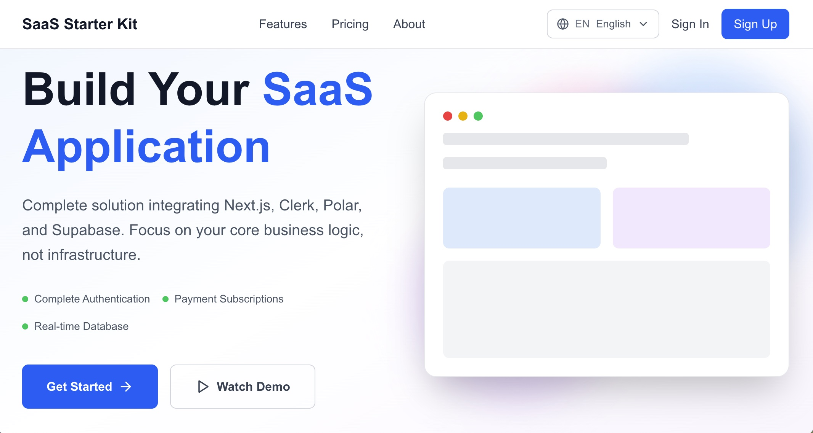

# Next-Clerk-Polar-Supabase Starter Kit

**語言**: [English](README.md) | [繁體中文](README.zh-TW.md)



🌐 **線上演示**: [https://next-clerk-ploar-supabase-starter-k.vercel.app/](https://next-clerk-ploar-supabase-starter-k.vercel.app/)

> 🚀 一個現代化的 SaaS 應用程式模板，整合了 Next.js、Clerk、Polar 和 Supabase，提供完整的用戶認證、付費訂閱和資料管理功能。

[](https://nextjs.org/)
[](https://www.typescriptlang.org/)
[](https://tailwindcss.com/)
[](https://clerk.com/)
[](https://polar.sh/)
[](https://supabase.com/)

## ✨ 已實現功能

- 🎨 **SaaS 登陸首頁** - 響應式設計，包含 Hero、功能介紹、價格方案、用戶推薦等完整區塊
- 🔐 **Clerk 認證系統** - 用戶註冊、登入、路由保護、個人資料管理
- 💳 **Polar 付費整合** - 專業版訂閱 ($5/月)、Checkout 流程、Webhook 事件處理
- 🗄️ **Supabase 資料庫** - 用戶訂閱資料管理、即時狀態同步、Row Level Security
- 📊 **用戶儀表板** - 訂閱狀態顯示、方案管理、個人資料設定
- 🔄 **訂閱管理** - 智能升級/降級、立即取消/週期結束取消、狀態即時同步
- 🛡️ **安全機制** - Webhook 簽名驗證、權限控制、事件去重處理

## 🛠️ 技術棧

### 核心框架
- **Next.js 15.4.1** - React 全端框架，使用 App Router
- **React 19.1.0** - 前端 UI 框架
- **TypeScript 5.x** - 類型安全的 JavaScript

### 樣式與 UI
- **Tailwind CSS 4.x** - 實用優先的 CSS 框架
- **Lucide React** - 現代化圖示庫
- **PostCSS** - CSS 後處理器

### 整合服務
- **Clerk** - 用戶認證與管理
- **Polar** - 付費與訂閱管理
- **Supabase** - PostgreSQL 資料庫與後端服務

### 開發工具
- **ESLint 9.x** - 程式碼品質檢查
- **Turbopack** - 快速的打包工具（開發模式）

## 🎯 功能詳情

### 🎨 SaaS 登陸首頁 (已完成)
- ✅ **Header 導航欄** - 固定頂部導航，響應式設計，平滑滾動，整合認證狀態
- ✅ **Hero 英雄區塊** - 產品展示，CTA 按鈕，動態背景效果
- ✅ **Feature 功能介紹** - 4 個核心功能展示，圖示和說明
- ✅ **Pricing 價格方案** - 免費版 vs 專業版比較，熱門標記
- ✅ **Testimonial 用戶推薦** - 客戶推薦，統計數據，評分展示
- ✅ **Footer 頁尾** - 完整連結導航，社交媒體，電子報訂閱

### 🔐 Clerk 認證系統 (已完成)
- ✅ **用戶註冊** - 完整的註冊流程，電子郵件驗證
- ✅ **用戶登入** - 安全的登入系統，會話管理
- ✅ **路由保護** - 中間件保護敏感頁面，自動重定向
- ✅ **個人資料** - 用戶資訊顯示和基本設定
- ✅ **導航整合** - 根據認證狀態顯示不同介面

### 💳 Polar 付費系統 (已完成)
- ✅ **專業版訂閱** - $5/月 訂閱方案
- ✅ **Checkout 流程** - 安全的付款處理
- ✅ **Webhook 處理** - 即時事件同步
- ✅ **訂閱管理** - 升級、降級、取消功能
- ✅ **安全驗證** - HMAC-SHA256 簽名驗證

### 🗄️ Supabase 資料庫 (已完成)
- ✅ **用戶資料表** - user_profiles 完整結構
- ✅ **訂閱資料** - polar_customer_id, polar_subscription_id, current_period_end 等欄位
- ✅ **權限控制** - Row Level Security (RLS)
- ✅ **即時同步** - Webhook 觸發自動更新
- ✅ **類型安全** - 完整的 TypeScript 類型定義

### 📊 用戶儀表板 (已完成)
- ✅ **訂閱狀態** - 即時顯示訂閱狀態和到期時間
- ✅ **方案管理** - 升級到專業版、取消訂閱
- ✅ **個人資料** - 基本用戶資訊管理
- ✅ **導航系統** - 清晰的儀表板導航

## 🏗️ 專案結構

```
Next-Clerk-Polar-Supabase Starter Kit/
├── src/                          # 原始碼目錄
│   ├── app/                      # Next.js App Router 目錄
│   │   ├── api/                  # API 路由目錄
│   │   │   ├── user/subscription/route.ts # 用戶訂閱資料 API
│   │   │   ├── polar/create-checkout/route.ts # Polar Checkout API
│   │   │   ├── webhooks/clerk/route.ts    # Clerk Webhook 處理
│   │   │   └── webhooks/polar/route.ts    # Polar Webhook 處理
│   │   ├── sign-in/              # 登入頁面
│   │   ├── sign-up/              # 註冊頁面
│   │   ├── dashboard/            # 用戶儀表板
│   │   │   ├── page.tsx          # 儀表板首頁（真實訂閱資料）
│   │   │   ├── subscription/page.tsx # 訂閱管理頁面
│   │   │   ├── checkout-success/page.tsx # 付費成功頁面
│   │   │   └── profile/page.tsx  # 個人資料頁面
│   │   ├── globals.css           # 全域樣式（含自訂動畫）
│   │   ├── layout.tsx            # 根佈局組件（含 ClerkProvider）
│   │   └── page.tsx              # 首頁組件（SaaS 登陸頁）
│   ├── components/               # React 組件目錄
│   │   ├── Header.tsx            # 導航欄組件（整合 Clerk）
│   │   ├── HeroSection.tsx       # 英雄區塊組件
│   │   ├── FeatureSection.tsx    # 功能介紹組件
│   │   ├── PricingSection.tsx    # 價格方案組件
│   │   ├── TestimonialSection.tsx # 用戶推薦組件
│   │   ├── Footer.tsx            # 頁尾組件
│   │   └── dashboard/DashboardNav.tsx # 儀表板導航
│   ├── lib/                      # 工具函數和服務
│   │   ├── supabase.ts           # Supabase 客戶端配置
│   │   ├── userProfileService.ts # 用戶訂閱資料服務
│   │   ├── polar.ts              # Polar API 客戶端配置
│   │   └── subscriptionUtils.ts  # 訂閱管理工具函數
│   ├── types/                    # TypeScript 類型定義
│   │   └── supabase.ts           # Supabase 相關類型
│   ├── hooks/                    # React Hooks
│   │   └── useUserProfile.ts     # 用戶訂閱資料 Hook
│   └── middleware.ts             # Clerk 路由保護中間件
├── documents/                    # 專案文檔目錄
│   ├── 當前專案架構.md           # 專案架構說明文件
│   ├── Clerk整合說明文件.md      # Clerk 認證系統整合指南
│   ├── Supabase配置與使用說明.md # Supabase 資料庫配置指南
│   ├── Polar金流整合說明.md      # Polar 金流整合說明
│   └── 功能/                     # 功能需求文檔
├── public/                       # 靜態資源目錄
├── package.json                  # 專案配置與依賴
├── tsconfig.json                 # TypeScript 配置
├── next.config.ts                # Next.js 配置
├── postcss.config.mjs            # PostCSS 配置
├── eslint.config.mjs             # ESLint 配置
└── README.md                     # 專案說明文件
```

## 🚀 快速開始

### 1. 克隆專案
```bash
git clone https://github.com/highsunday/Next-Clerk-Polar-Supabase-Starter-Kit.git
cd Next-Clerk-Polar-Supabase-Starter-Kit
```

### 2. 安裝依賴
```bash
npm install
```

### 3. 環境變數設定
創建 `.env.local` 檔案並填入您的 API 金鑰：

```env
# Clerk 認證系統
NEXT_PUBLIC_CLERK_PUBLISHABLE_KEY=your_clerk_publishable_key
CLERK_SECRET_KEY=your_clerk_secret_key
NEXT_PUBLIC_CLERK_SIGN_IN_URL=/sign-in
NEXT_PUBLIC_CLERK_SIGN_UP_URL=/sign-up

# Supabase 資料庫
NEXT_PUBLIC_SUPABASE_URL=your_supabase_url
NEXT_PUBLIC_SUPABASE_ANON_KEY=your_supabase_anon_key
SUPABASE_SERVICE_ROLE_KEY=your_supabase_service_role_key

# Polar 付費系統
POLAR_ACCESS_TOKEN=your_polar_access_token
POLAR_WEBHOOK_SECRET=your_polar_webhook_secret
NEXT_PUBLIC_POLAR_PRO_PRODUCT_ID=your_polar_pro_product_id
```

### 4. 設定服務

在開始使用之前，您需要依序設定三個核心服務：Clerk（認證）、Supabase（資料庫）和 Polar（付費）。建議按此順序進行配置，因為後續服務依賴前面的設定。

#### Clerk 認證設定
建立認證應用程式、配置登入頁面、設定 Webhook 整合。

**主要步驟：**
1. 在 Clerk Dashboard 建立新應用程式
2. 配置認證策略（Email + Password / 社交登入）
3. 設定登入/註冊頁面路徑
4. 配置 Webhook 端點 `/api/webhooks/clerk`
5. 獲取 API 金鑰並設定環境變數
6. 測試用戶註冊和登入流程

📖 詳細步驟請參考：[Clerk 認證策略配置指南](./documents/Clerk認證策略配置指南.md)

#### Supabase 資料庫設定
設定 PostgreSQL 資料庫、建立用戶資料表結構、配置安全政策。

**主要步驟：**
1. 在 Supabase 建立新專案
2. 執行 SQL 腳本建立 `user_profiles` 資料表
3. 設定 Row Level Security (RLS) 政策
4. 獲取 API 金鑰並配置環境變數
5. 測試資料庫連接和權限
6. 整合 Clerk Webhook 以自動建立用戶資料

📖 詳細步驟請參考：[Supabase 配置與使用說明](./documents/Supabase配置與使用說明.md)

#### Polar 付費設定
建立付費帳戶、設定訂閱產品、配置 Webhook 事件處理。

**主要步驟：**
1. 註冊 Polar 帳戶並選擇環境（Sandbox/Production）
2. 建立組織和專業版產品（$5/月）
3. 配置 Webhook 端點 `/api/webhooks/polar`
4. 獲取 Access Token 和 Webhook Secret
5. 設定環境變數並測試付費流程
6. 驗證 Webhook 事件與 Supabase 資料同步

📖 詳細步驟請參考：[Polar 配置與準備說明](./documents/Polar配置與準備說明.md)

### 5. 啟動開發伺服器
```bash
npm run dev
```

開啟 [http://localhost:3000](http://localhost:3000) 查看結果。

### 6. 測試功能
1. 註冊新用戶帳戶
2. 登入並查看儀表板
3. 測試專業版訂閱流程
4. 驗證 Webhook 事件處理

## 📖 詳細文檔

### 配置指南
- [Clerk 認證系統配置指南](./documents/Clerk認證策略配置指南.md) | [English](./documents/Clerk-Authentication-Configuration-Guide.md)
- [Supabase 資料庫配置指南](./documents/Supabase配置與使用說明.md) | [English](./documents/Supabase-Configuration-Guide.md)
- [Polar 付費系統配置指南](./documents/Polar配置與準備說明.md) | [English](./documents/Polar-Configuration-Guide.md)

### 架構文檔
- [當前專案架構說明](./documents/當前專案架構.md) | [English](./documents/Project-Architecture-Overview.md)
- [功能需求文檔](./documents/功能/)

## 🔮 TODO 功能

### 認證系統擴展
- [ ] 社交登入整合 (Google, GitHub, Discord)
- [ ] 多因素認證 (MFA)
- [ ] 組織管理和邀請系統
- [ ] 密碼重置功能

### 付費系統擴展
- [ ] 年付優惠方案
- [ ] 發票下載功能
- [ ] 退款處理
- [ ] 試用期管理
- [ ] 付款歷史頁面

### 資料庫功能
- [ ] 即時資料同步 (Realtime)
- [ ] 檔案上傳和儲存
- [ ] 資料備份機制

### 前端功能
- [ ] 管理後台
- [ ] 國際化支援 (i18n)
- [ ] 深色模式
- [ ] PWA 支援
- [ ] SEO 優化

### 開發工具
- [ ] 單元測試 (Jest)
- [ ] E2E 測試 (Playwright)
- [ ] CI/CD 流程
- [ ] Docker 容器化

## 🤝 貢獻

歡迎貢獻！請先閱讀我們的貢獻指南。

1. Fork 這個專案
2. 創建您的功能分支 (`git checkout -b feature/AmazingFeature`)
3. 提交您的更改 (`git commit -m 'Add some AmazingFeature'`)
4. 推送到分支 (`git push origin feature/AmazingFeature`)
5. 開啟一個 Pull Request

## 📄 授權

這個專案使用 MIT 授權 - 查看 [LICENSE](LICENSE) 檔案了解詳情。

## 🌟 支援

如果這個專案對您有幫助，請給我們一個 ⭐️！

### 問題回報
如果您發現任何問題，請在 [GitHub Issues](https://github.com/highsunday-projects/Next-Clerk-Polar-Supabase-Starter-Kit/issues) 中回報。

---

**專案特色**：完整的 SaaS 應用程式模板，包含認證、付費、資料庫整合
**技術棧**：Next.js 15 + Clerk + Polar + Supabase + TypeScript + Tailwind CSS
**適用於**：想要快速建立 SaaS 應用程式的開發者
